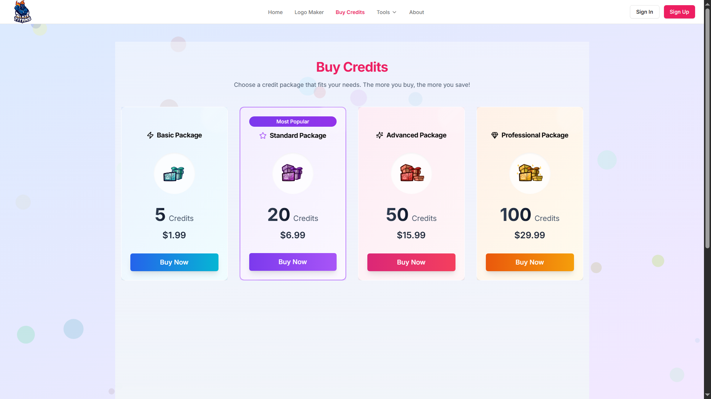
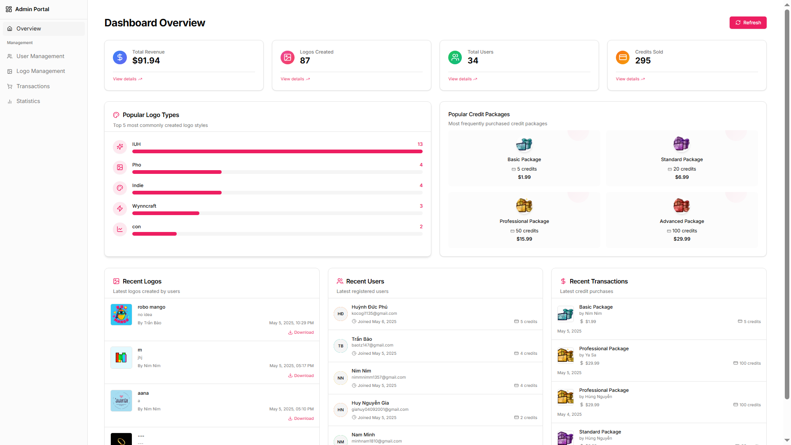
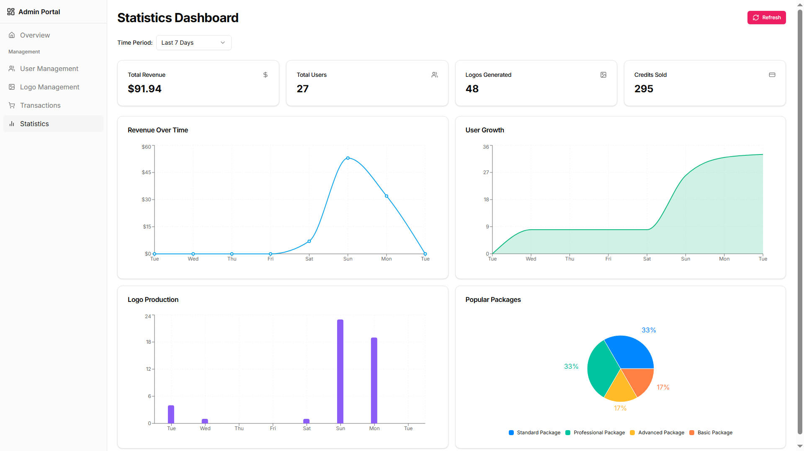
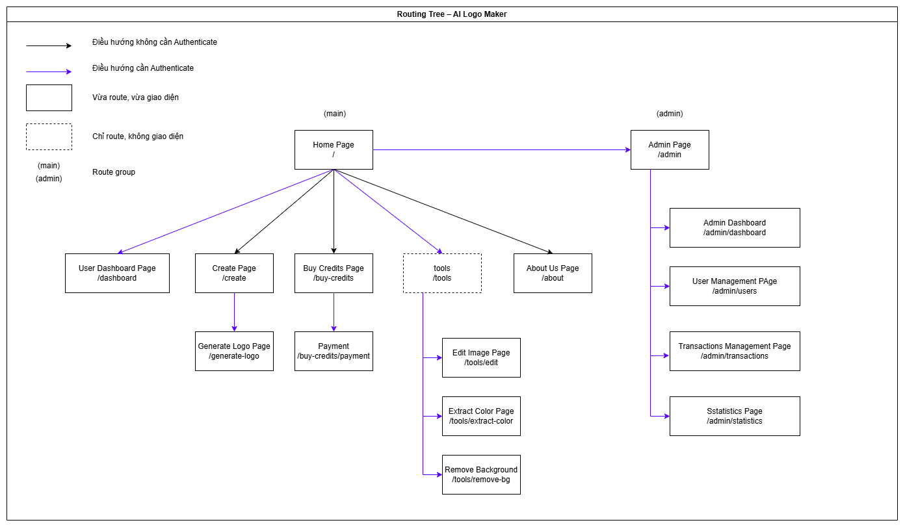
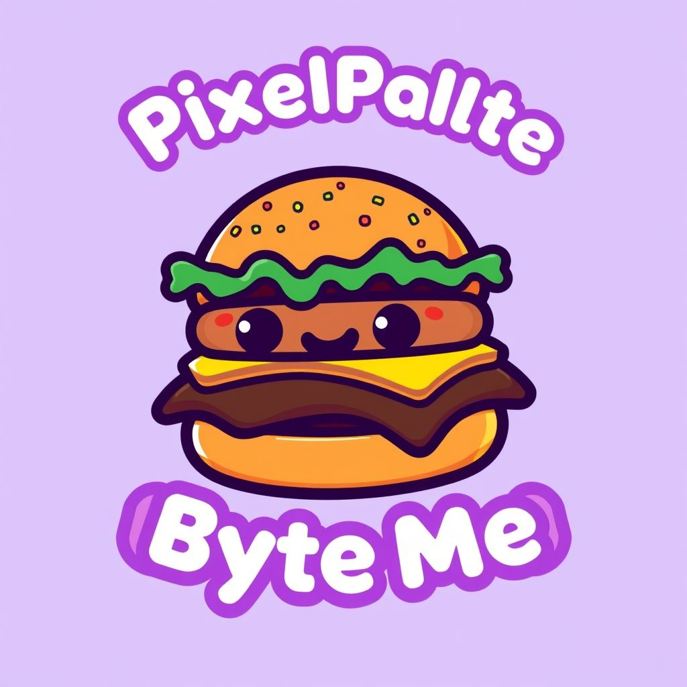
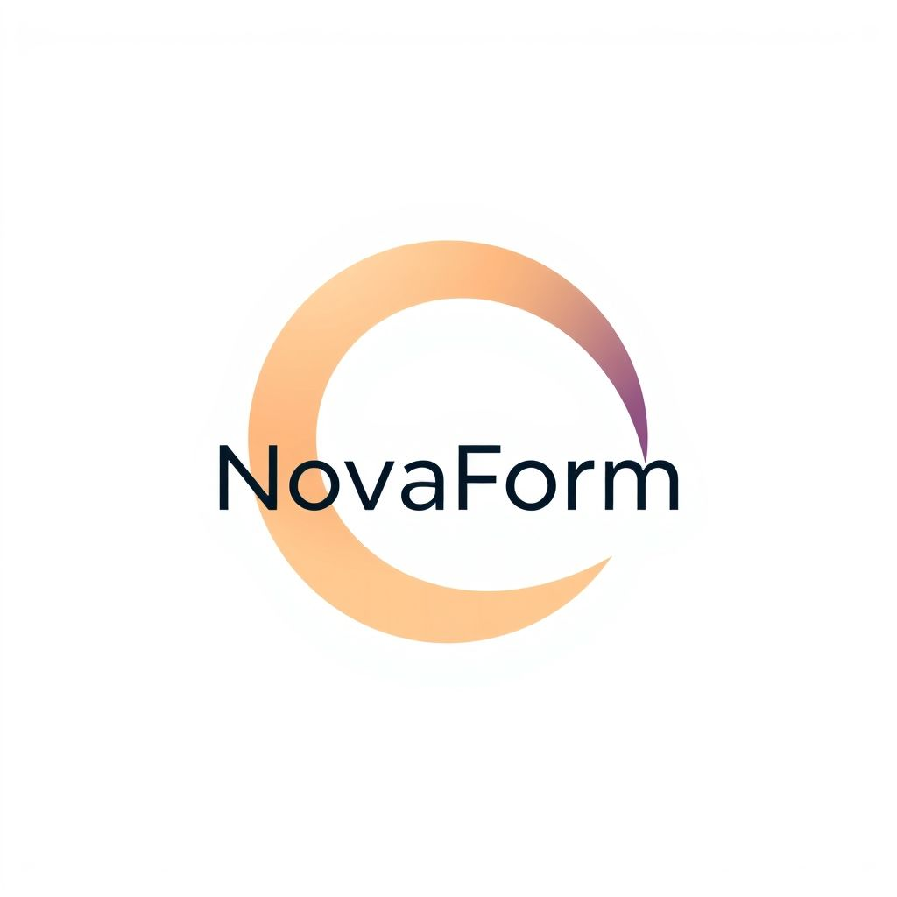

# 🎨 AI Logo Maker

Một ứng dụng tạo logo tự động sử dụng trí tuệ nhân tạo (AI), được xây dựng bằng **Next.js**, **React**, và tích hợp **Gemini API** kết hợp với **Flux AI Text-to-Image Generator**. Người dùng chỉ cần nhập mô tả, hệ thống sẽ tạo ra một logo độc đáo phù hợp với nhu cầu thiết kế của họ.

---

## 👨‍💻 Thành viên nhóm

- **Nguyễn Văn Hùng**
- **Huỳnh Đức Phú**

---

## 🚀 Tính năng chính

- ✅ Tạo logo bằng mô tả văn bản (prompt)
- 🎯 Tùy chỉnh phong cách và mô tả logo theo yêu cầu người dùng
- 📷 Hiển thị và tải về hình ảnh logo được tạo từ AI
- ♻️ Lưu lịch sử các logo đã tạo
- 🧠 Sử dụng trí tuệ nhân tạo để sinh ảnh sáng tạo từ văn bản

---

## 🧰 Công nghệ sử dụng

- **ReactJS**
- **Next.js**
- **Gemini API** (Google AI)
- **Flux AI Text-to-Image Generator**
- **Tailwind CSS**
- **Axios**

---

## 🌐 Giao diện

<div style="text-align: center;">
  
  
  
  
</div>

---

## 🌐 Cây điều hướng

<div style="text-align: center;">
  
</div>

---

## 📷 Demo AI Generated Logo

<div style="display: flex; gap: 10px; flex-wrap: wrap; justify-content: center;">
  
  
  
  
</div>

---

## 📦 Cài đặt và chạy dự án

```bash
# Cài dependencies
npm install

# Chạy ứng dụng
npm run dev
```

## 🔐 Template API Key (.env)

```bash
# Gemini API từ Google AI
GEMINI_API_KEY=

# Clerk Authentication
NEXT_PUBLIC_CLERK_PUBLISHABLE_KEY=
CLERK_SECRET_KEY=

# Firebase API Key
NEXT_PUBLIC_FIREBASE_API_KEY=

# RapidAPI Key
RAPIDAPI_KEY=

# Remove Background API Key
API_REMOVE_BG_KEY =

```
